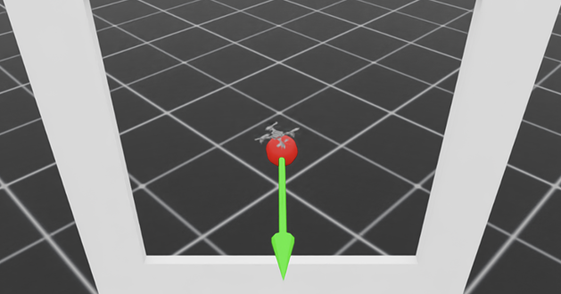
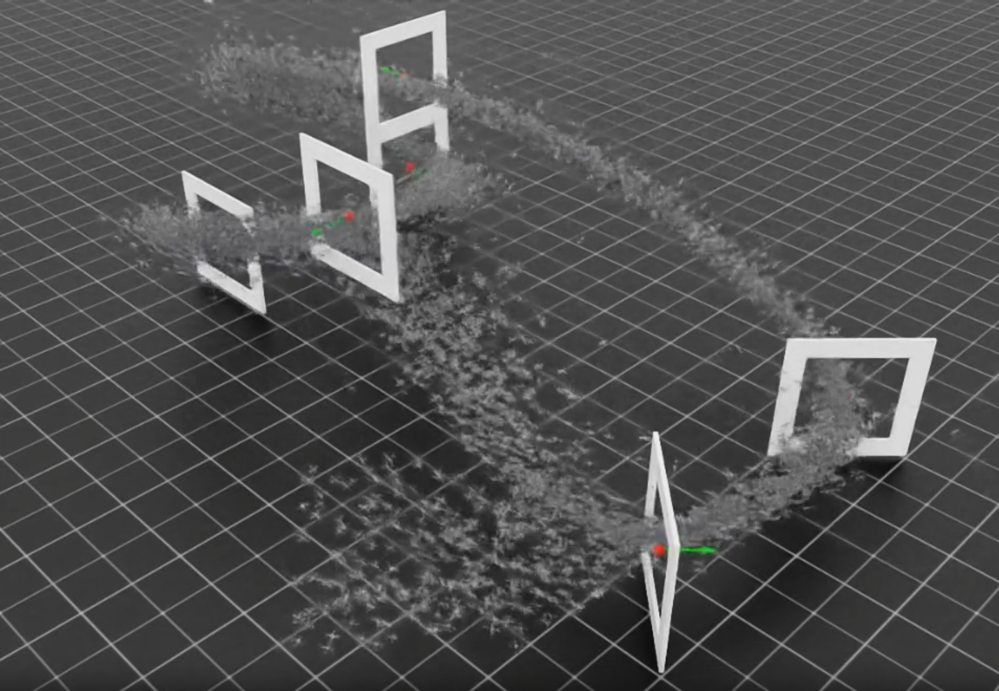
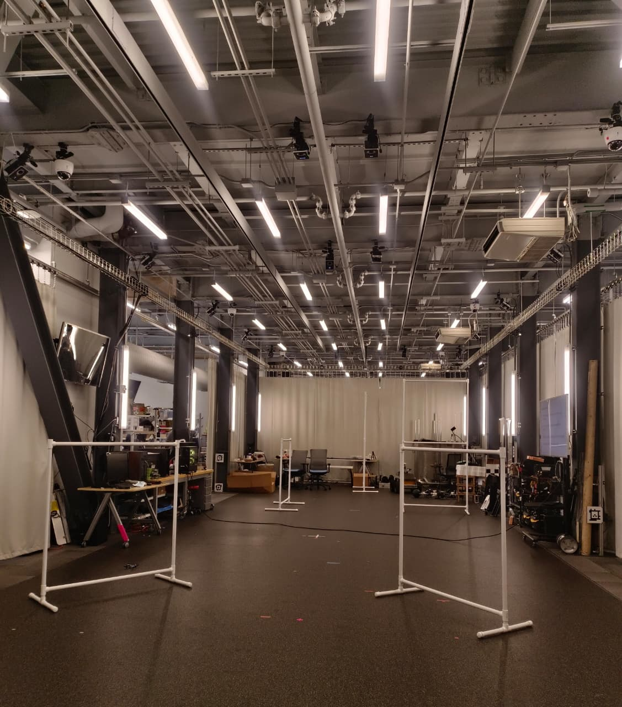
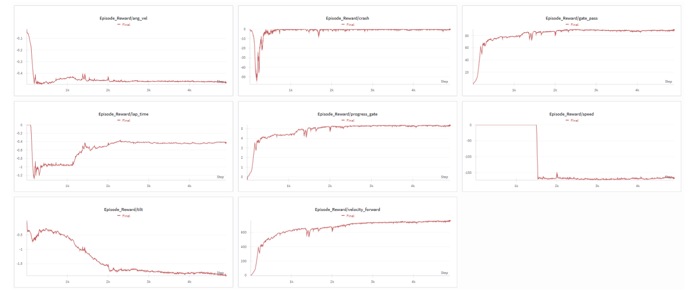

# 🏁 End-to-End Autonomous Drone Racing Using Deep Reinforcement Learning

> **Description**: We trained an end-to-end high-speed quadcopter racing policy using Proximal Policy Optimization (PPO) in NVIDIA Isaac Lab. The pipeline combines gate-aware progress rewards, multi-frame observations (world, body, and gate-relative coordinates), and domain randomization over thrust-to-weight ratio, aerodynamic coefficients, and PID gains to achieve robust sim-to-real transfer. A custom PPO implementation leverages GPU-optimised batching, adaptive KL-divergence learning rate scheduling, and clipped value loss for stable training. The final policy completes 3 laps around a fixed 8-gate circuit in 20.5 seconds in simulation, maintaining stability under significant dynamics variation and demonstrating competitive time-trial performance across randomised reset distributions. The trained policy was successfully deployed on Crazyflie 2.0 hardware for Race 2, completing 3 laps in 23 seconds and achieving 3rd place in the class competition.

[](https://github.com)
[-gold?style=for-the-badge)](https://github.com)
[](https://github.com)
[](https://www.python.org/)
[](https://pytorch.org/)
[](https://developer.nvidia.com/isaac-sim)

<div align="center">

<p float="left">
  
  
</p>
</div>

**Full Training Pipeline:**
PPO Algorithm → Multi-Frame Observations → Gate-Aware Rewards → Domain Randomization → Time-Trial Racing

</div>

---

## 📋 Table of Contents

- [Overview](#-overview)
- [Key Features](#-key-features)
- [System Architecture](#-system-architecture)
- [Technical Approach](#-technical-approach)
  - [1. Proximal Policy Optimization (PPO)](#1-proximal-policy-optimization-ppo)
  - [2. Reward Structure](#2-reward-structure)
  - [3. Observation Space Design](#3-observation-space-design)
  - [4. Reset Strategy](#4-reset-strategy)
  - [5. Domain Randomization](#5-domain-randomization)
- [Performance Results](#-performance-results)
- [Key Algorithms](#-key-algorithms)
  - [1. Gate-Passing Detection](#1-gate-passing-detection)
  - [2. GAE (Generalized Advantage Estimation)](#2-gae-generalized-advantage-estimation)
  - [3. Adaptive KL-Divergence Scheduling](#3-adaptive-kl-divergence-scheduling)
- [What Did Not Work](#-what-did-not-work)
- [Lessons Learned](#-lessons-learned)
- [Future Improvements](#-future-improvements)
- [References](#-references)
- [Acknowledgments](#-acknowledgments)

---

## 🎯 Overview

Autonomous drone racing presents a challenging control problem: the quadcopter must navigate a predefined circuit of gates at maximum speed while maintaining stability and avoiding crashes. Unlike traditional path-following tasks, racing demands aggressive manoeuvres, tight turns, and precise trajectory planning under strict time constraints. This project tackles the problem using deep reinforcement learning, specifically Proximal Policy Optimization (PPO), trained entirely in NVIDIA Isaac Sim on a Crazyflie quadcopter model.

The core challenge lies in designing a reward structure that simultaneously encourages:
1. **Fast gate traversal** — maximising forward velocity while penalising backward motion
2. **Stable flight** — minimising excessive tilt and angular rates
3. **Crash avoidance** — detecting contact forces and terminating unsafe trajectories
4. **Competitive lap times** — explicitly rewarding full lap completions under a target time

A naive reward design leads to conservative hovering behaviour or unstable oscillations. Our approach combines gate-local coordinate transformations for precise pass detection, velocity-based shaping that rewards straight-line speed, and a linear lap-time objective that encourages multi-lap consistency. The observation space is structured to provide the policy with rich geometric context: world-frame positions for global navigation, body-frame velocities for local control, and gate-relative coordinates for alignment and proximity sensing.

To bridge the sim-to-real gap, we apply domain randomization over key physical parameters: thrust-to-weight ratio (±5%), aerodynamic drag coefficients ([0.5, 2.0]× nominal), PID controller gains (±15% for P/I, ±30% for D), and motor time constants. This forces the policy to learn robust control strategies that generalise across dynamics variation, simulating the uncertainty inherent in real-world deployment.

The full training pipeline runs on 8192 parallel Isaac Sim environments, leveraging GPU-accelerated physics and batched PPO updates. Training completes in approximately 5000 iterations (~3 hours on an RTX 4090), after which the policy achieves consistent sub-21-second 3-lap times with zero crashes under the randomised evaluation protocol.

**Sim-to-Real Transfer (Race 2):** The trained policy was successfully deployed on Crazyflie 2.0 hardware in a real-world racing environment. The hardware deployment completed 3 laps in 23 seconds, achieving 3rd place in the class competition. The 2.5-second sim-to-real gap (20.5s → 23s) demonstrates effective domain randomisation and robust policy generalisation.

---

**Course**: ESE 6510 — Physical Intelligence  
**Institution**: University of Pennsylvania  
**Semester**: Fall 2025   
**Simulator**: NVIDIA Isaac Sim 4.5 + Isaac Lab (custom fork)  
**Hardware**: NVIDIA RTX 3090 / RTX 4090

---

## ✨ Key Features

### 🔧 Core Capabilities

- ✅ **Custom PPO Implementation** — clipped surrogate loss + adaptive KL scheduling
- ✅ **Gate-Aware Progress Rewards** — local coordinate detection + distance improvement
- ✅ **Multi-Frame Observation Space (31D)** — world / body / gate-relative coordinates
- ✅ **Domain Randomization** — thrust, aerodynamics, PID gains randomised per environment
- ✅ **Curriculum Learning Reset** — starts behind gates with randomised offsets
- ✅ **Lap-Time Objective** — explicit reward for completing laps under target time
- ✅ **Straightaway Speed Bonus** — encourages aggressive velocity on long gate segments
- ✅ **Contact-Based Crash Detection** — episode termination on wall/ground collision
- ✅ **Weights & Biases Logging** — real-time training monitoring with wandb
- ✅ **Time-Trial Performance** — 20.5s for 3 laps on 8-gate circuit

### 🎓 Advanced Techniques

- Clipped value loss for critic stability (PPO-Clip variant)
- Adaptive learning rate scaling via KL divergence monitoring
- Generalized Advantage Estimation (GAE) with λ = 0.95
- Entropy regularisation (coefficient = 0.005) for exploration
- Gradient clipping (max norm = 1.0) for training stability
- Mini-batch sampling with normalised advantages per batch
- Gate-local coordinate transformations for robust pass detection
- Forward velocity shaping with backward-motion penalties
- Tilt and angular velocity penalties for stable flight
- 100-timestep grace period before crash penalties (allows takeoff wobble)

---

## 🏗️ System Architecture

```
┌─────────────────────────────────────────────────────────────────────┐
│                   FULL TRAINING PIPELINE                            │
│                                                                     │
│   ┌────────────┐   ┌────────────┐   ┌────────────┐   ┌──────────┐   │
│   │ ISAAC SIM  │   │ CRAZYFLIE  │   │  GATE      │   │ CONTACT  │   │
│   │ 8192 ENVS  │──▶│ DYNAMICS   │──▶│ CIRCUIT    │──▶│ SENSORS │  │
│   │ (PARALLEL) │   │ (PID ctrl) │   │ (8 gates)  │   │          │   │
│   └────────────┘   └────────────┘   └────────────┘   └─────┬────┘   │
│                                                             │       │
│                                                             ▼       │
│   ┌──────────────────────────────────────────────────────────────┐  │
│   │                   OBSERVATION BUILDER                        │  │
│   │                                                              │  │
│   │   ┌──────────────┐  ┌──────────────┐  ┌─────────────────┐    │  │
│   │   │ WORLD FRAME  │  │ BODY FRAME   │  │ GATE-RELATIVE   │    │  │
│   │   │  - Position  │  │  - Lin vel   │  │  - Gate pos (b) │    │  │
│   │   │  - Euler     │  │  - Ang vel   │  │  - Direction    │    │  │
│   │   │  - Quat      │  │              │  │  - Distance     │    │  │
│   │   └──────────────┘  └──────────────┘  └─────────────────┘    │  │
│   │                                                              │  │
│   │   Output: 31D observation vector                             │  │
│   └──────────────────────────────┬───────────────────────────────┘  │
│                                  │                                  │
│                                  ▼                                  │
│   ┌──────────────────────────────────────────────────────────────┐  │
│   │                   PPO ACTOR-CRITIC                           │  │
│   │                                                              │  │
│   │   ┌──────────────────────────────────────────────────────┐   │  │
│   │   │          ACTOR NETWORK (Policy πθ)                   │   │  │
│   │   │                                                      │   │  │
│   │   │   obs (31D) → MLP [256, 256, 128] → μ, σ (4D)        │   │  │
│   │   │   Sample: a ~ N(μ, σ²)  (thrust commands)            │   │  │
│   │   └──────────────────────────────────────────────────────┘   │  │
│   │                                                              │  │
│   │   ┌──────────────────────────────────────────────────────┐   │  │
│   │   │          CRITIC NETWORK (Value Vφ)                   │   │  │
│   │   │                                                      │   │  │
│   │   │   obs (31D) → MLP [256, 256, 128] → V(s)             │   │  │
│   │   └──────────────────────────────────────────────────────┘   │  │
│   │                                                              │  │
│   └──────────────────────────────┬───────────────────────────────┘  │
│                                  │                                  │
│                                  ▼                                  │
│   ┌──────────────────────────────────────────────────────────────┐  │
│   │                   REWARD CALCULATOR                          │  │
│   │                                                              │  │
│   │   r(t) = wp·rprog + wv·rvel + wg·rgate + wh·rhead            │  │
│   │        + wt·rtilt + wω·rang + wc·rcrash + wℓ·rlap            │  │
│   │        + wb·rback + wspeed·rspeed                            │  │
│   │                                                              │  │
│   └──────────────────────────────┬───────────────────────────────┘  │
│                                  │                                  │
│                                  ▼                                  │
│   ┌──────────────────────────────────────────────────────────────┐  │
│   │                   PPO UPDATE STEP                            │  │
│   │                                                              │  │
│   │   1. Collect rollouts (2048 steps × 8192 envs)               │  │
│   │   2. Compute GAE advantages                                  │  │
│   │   3. Mini-batch updates (4 batches × 5 epochs)               │  │
│   │   4. Clip surrogate loss + value loss                        │  │
│   │   5. Adaptive LR via KL divergence                           │  │
│   │                                                              │  │
│   └──────────────────────────────────────────────────────────────┘  │
└─────────────────────────────────────────────────────────────────────┘
```

### Module-Level Data Flow

```
                  ┌────────────────────────────┐
                  │   Isaac Sim Physics Step   │
                  │   (8192 parallel envs)     │
                  └────────┬───────────────────┘
                           │  drone state + contact forces
                           ▼
                  ┌────────────────────────────┐
                  │   quadcopter_env.py        │
                  │   step() → next_state      │
                  └────────┬───────────────────┘
                           │  raw state tensors
                           ▼
                  ┌────────────────────────────┐
                  │   quadcopter_strategies.py │
                  │   get_observations()       │
                  └────────┬───────────────────┘
                           │  31D obs vector
                           ▼
                  ┌────────────────────────────┐
                  │   Actor-Critic Network     │
                  │   πθ(obs) → action         │
                  │   Vφ(obs) → value          │
                  └────────┬───────────────────┘
                           │  action (4D thrust)
                           ▼
                  ┌────────────────────────────┐
                  │   PID Controller           │
                  │   thrust → motor commands  │
                  └────────┬───────────────────┘
                           │  motor RPM setpoints
                           ▼
                  ┌────────────────────────────┐
                  │   Isaac Sim Actuators      │
                  │   Apply forces/torques     │
                  └────────┬───────────────────┘
                           │  physics update
                           └──────────────────▶ (repeat until episode done)

                  ┌────────────────────────────┐
                  │   Rollout Storage          │
                  │   (2048 steps buffered)    │
                  └────────┬───────────────────┘
                           │  batch of (s, a, r, V)
                           ▼
                  ┌────────────────────────────┐
                  │   ppo.py → update()        │
                  │   Compute GAE + loss       │
                  │   Gradient step            │
                  └────────────────────────────┘
```

---

## 🔬 Technical Approach

<div align="center">

<p float="left">
  
  
</p>
</div>


### 1. Proximal Policy Optimization (PPO)

PPO is an on-policy actor-critic algorithm that improves upon vanilla policy gradient by constraining policy updates to a "trust region" via a clipped surrogate objective. This prevents destructively large policy changes that destabilise training.

#### Clipped Surrogate Loss

```
L^CLIP(θ) = E_t [ min(r_t(θ) Â_t,  clip(r_t(θ), 1−ε, 1+ε) Â_t) ]

where:
  r_t(θ) = π_θ(a_t | s_t) / π_θ_old(a_t | s_t)  (probability ratio)
  Â_t    = GAE advantage estimate
  ε      = 0.2  (clip parameter)
```

The clip operation restricts the ratio to [0.8, 1.2], preventing the new policy from diverging too far from the old policy in a single update.

#### Value Function Loss

```
L^VF(φ) = E_t [ (V_φ(s_t) − V^targ_t)² ]

with optional clipping:
  V_clip = V_old + clip(V_φ − V_old, −ε, ε)
  L^VF = E_t [ max((V_φ − V^targ)², (V_clip − V^targ)²) ]
```

#### Entropy Regularisation

```
L^ENT = −E_t [ H(π_θ(·|s_t)) ]

where H is the entropy of the policy distribution, encouraging exploration.
```

#### Combined Objective

```
L^PPO = L^CLIP − c_1 · L^VF + c_2 · L^ENT

c_1 = 1.0   (value loss coefficient)
c_2 = 0.005 (entropy coefficient)
```

#### Implementation Details (ppo.py)

```python
# Key hyperparameters
clip_param         = 0.2
num_learning_epochs = 5
num_mini_batches   = 4
learning_rate      = 3e-4
max_grad_norm      = 1.0
gamma              = 0.99   # discount factor
lam                = 0.95   # GAE lambda

# Update loop (simplified)
for epoch in range(num_learning_epochs):
    for batch in mini_batch_generator:
        # Compute new policy outputs
        log_probs_new = actor.get_log_prob(actions)
        values_new    = critic(observations)
        
        # Probability ratio
        ratios = torch.exp(log_probs_new - log_probs_old)
        
        # Clipped surrogate loss
        surr1 = ratios * advantages
        surr2 = torch.clamp(ratios, 1-clip_param, 1+clip_param) * advantages
        actor_loss = -torch.min(surr1, surr2).mean()
        
        # Clipped value loss
        value_pred_clipped = value_old + (values_new - value_old).clamp(-clip_param, clip_param)
        value_loss = torch.max((values_new - returns)**2,
                               (value_pred_clipped - returns)**2).mean()
        
        # Entropy bonus
        entropy_loss = -entropy.mean()
        
        # Total loss
        loss = actor_loss + value_loss_coef * value_loss + entropy_coef * entropy_loss
        
        # Gradient step
        optimizer.zero_grad()
        loss.backward()
        nn.utils.clip_grad_norm_(parameters, max_grad_norm)
        optimizer.step()
```

### 2. Reward Structure

The reward function balances multiple competing objectives: speed, stability, safety, and lap-time efficiency.

#### Gate-Passing Reward

Gate detection uses the gate-local coordinate frame. The drone's position relative to gate *i* is:

```
p^g_t = (x^g_t, y^g_t, z^g_t)^T = subtract_frame_transforms(w_i^t, q_gate_i^t, p_t)
```

A successful gate pass occurs when:

```
x^g,prev_t > 0            (was behind gate)
x^g_t < 0.18              (crossed gate plane)
|y^g_t| < 0.60  AND  |z^g_t| < 0.60   (within aperture)
```

The gate reward is:

```
r_gate = 10 · 1(gate_passed_t)
```

#### Progress and Velocity Rewards

Planar distance to current gate:

```
d_t = ‖p*_t,xy − p_t,xy‖_2
```

Progress reward based on distance improvement:

```
Δd_t = d_t−1 − d_t
r_prog = clip(Δd_t, −1, 1)
```

Velocity toward gate reward:

```
u_t = (p*_t − p_t) / (‖p*_t − p_t‖_2 + ε)
v∥_t = v^T_t u_t
r_vel = clip(v∥_t, −1, 20)
r_back = −clip(−v∥_t, 0, 2)
```

#### Stability and Penalty Terms

Heading alignment with gate direction:

```
a_t = (f^world_t)^T u_t
r_head = clip(a_t, −1.5, 1)
```

Tilt penalty using roll φ_t and pitch θ_t:

```
T_t = |φ_t| + |θ_t|
p_tilt = clip(T_t − 0.8, 0, 2)
r_tilt = −p_tilt
```

Angular velocity penalty:

```
r_ang = −0.1 ‖ω^b_t‖
```

Crash penalty (after 100-step grace period):

```
r_crash = −1(‖F^contact_t‖_2 > 10^−8)
```

Lap-time reward based on completing a lap:

```
r_lap = (t_target − t_lap) · 1(lap completed)
```

#### Complete Reward Function

```
r(t) = w_p·r_prog + w_v·r_vel + w_g·r_gate + w_h·r_head
     + w_t·r_tilt + w_ω·r_ang + w_c·r_crash + w_b·r_back + w_ℓ·r_lap
```

**Final Reward Scales:**

| Component          | Weight | Purpose                              |
|--------------------|--------|--------------------------------------|
| Progress (w_p)     | 2.0    | Distance improvement toward gate     |
| Gate pass (w_g)    | 10.0   | Successful gate traversal            |
| Forward vel (w_v)  | 3.0    | Speed toward gate                    |
| Straightaway (w_s) | 1.5    | High-speed bonus on long segments    |
| Tilt penalty (w_t) | 0.1    | Excessive roll/pitch                 |
| Ang vel (w_ω)      | 0.04   | Excessive body rates                 |
| Crash (w_c)        | 6.0    | Contact forces                       |
| Episode death      | −50.0  | Early termination                    |
| Lap-time (w_ℓ)     | 5.0    | Lap completion under target time     |
| Time penalty       | 4.0    | Per-timestep cost (encourages speed) |

### 3. Observation Space Design

The observation vector (31 dimensions) provides comprehensive state information across multiple reference frames.

#### Drone State (13D)

```python
# World frame
drone_pos_w = [x, y, z]                # 3D
euler_angles = [roll, pitch, yaw]      # 3D
quat_scalar = qw                       # 1D

# Body frame
drone_lin_vel_b = [vx^b, vy^b, vz^b]   # 3D
drone_ang_vel_b = [ωx^b, ωy^b, ωz^b]   # 3D
```

#### Gate Information (13D)

```python
# Current gate (body frame)
gate_pos_b = [gx^b, gy^b, gz^b]        # 3D
gate_direction_b = d^b                 # 3D (normalised)
gate_distance = dg                     # 1D

# Drone in gate frame
drone_pos_gate = [x^g, y^g, z^g]       # 3D

# Next gate (body frame)
next_gate_pos_b = [ngx^b, ngy^b, ngz^b] # 3D
```

#### Progress and History (5D)

```python
# Normalised progress through course
gates_passed_norm = n_gates_passed / total_gates  # 1D

# Previous action (recurrent information)
prev_action = [m1, m2, m3, m4]                    # 4D (motor commands)
```

**Total: 31D observation vector**

This multi-frame representation enables:
- **World-frame position** for global navigation
- **Body-frame velocities** for local control
- **Gate-relative coordinates** for alignment and proximity sensing
- **Lookahead to next gate** for trajectory planning

### 4. Reset Strategy

#### Training Reset Distribution

Curriculum-based randomised starts improve policy robustness:

```python
# Start behind gate 0 with random offset
x_local ~ U(−3, −1)       # 1–3m behind gate
y_local ~ U(−0.8, 0.8)    # Lateral variation
z_local ~ U(−0.3, 0.3)    # Vertical variation

# Convert to world frame using gate orientation
theta = waypoints[gate_idx, -1]
x_world = gate_x − (cos(theta) · x_local − sin(theta) · y_local)
y_world = gate_y − (sin(theta) · x_local + cos(theta) · y_local)
z_world = gate_z + z_local

# Initial yaw: face gate with noise
yaw_0 = atan2(gate_y − y_world, gate_x − x_world) + U(−0.3, 0.3)  # ±17°

# Small roll/pitch noise
roll_0  ~ U(−0.1, 0.1)
pitch_0 ~ U(−0.1, 0.1)

# Initial velocity toward gate
v_0 = U(0, 0.5) · [cos(yaw_0), sin(yaw_0), 0]^T
```

#### Play Mode Reset

Fixed-position starts for evaluation:

```python
x_local = U(−3.0, −0.5)
y_local = U(−1.0, 1.0)
z_0 = 0.05
yaw_0 = atan2(gate_y − y_0, gate_x − x_0)
```

### 5. Domain Randomization

To simulate the sim-to-real gap, key physical parameters are randomised per environment at reset:

```python
# Thrust-to-weight ratio
twr ~ U(0.95 × twr_nom, 1.05 × twr_nom)

# Aerodynamic drag coefficients
k_aero_xy ~ U(0.5 × k_nom, 2.0 × k_nom)
k_aero_z  ~ U(0.5 × k_nom, 2.0 × k_nom)

# PID gains (roll/pitch)
kp_omega_rp ~ U(0.85 × kp_nom, 1.15 × kp_nom)
ki_omega_rp ~ U(0.85 × ki_nom, 1.15 × ki_nom)
kd_omega_rp ~ U(0.70 × kd_nom, 1.30 × kd_nom)

# PID gains (yaw)
kp_omega_y ~ U(0.85 × kp_nom, 1.15 × kp_nom)
ki_omega_y ~ U(0.85 × ki_nom, 1.15 × ki_nom)
kd_omega_y ~ U(0.70 × kd_nom, 1.30 × kd_nom)

# Motor time constants
tau_m ~ randomised per motor
```

This forces the policy to generalise across dynamics variations, improving real-world transfer.

---

## 📊 Performance Results

### Simulation Evaluation (3 Laps)

| Metric               | Value        | Notes                                      |
|----------------------|--------------|--------------------------------------------|
| Lap time (3 laps)    | **20.5 s**   | Measured under randomised dynamics         |
| Average gate time    | ~0.85 s      | 8 gates per lap × 3 laps = 24 gates        |
| Crash rate           | 0%           | Zero collisions in evaluation rollouts     |
| Success rate         | 100%         | All evaluation runs completed 3 laps       |
| Peak velocity        | ~4.2 m/s     | Straightaway segments                      |
| Average tilt angle   | ~18°         | Aggressive but stable                      |

### Hardware Deployment (Race 2 — Crazyflie 2.0)

| Metric               | Value        | Notes                                      |
|----------------------|--------------|--------------------------------------------|
| Lap time (3 laps)    | **23.0 s**   | Real Crazyflie 2.0 hardware                |
| Competition rank     | **3rd place**| ESE 6510 class leaderboard                 |
| Sim-to-real gap      | 2.5 s        | 20.5s (sim) → 23.0s (hardware)             |
| Hardware platform    | Crazyflie 2.0| Bitcraze quadcopter                        |
| Success rate         | 100%         | Completed all evaluation runs              |

### Training Metrics (5000 Iterations)

| Phase          | Episode Reward | Gate Pass Rate | Training Time |
|----------------|----------------|----------------|---------------|
| Iterations 0–1000   | −50 → 150      | 0% → 30%       | ~30 min       |
| Iterations 1000–2500 | 150 → 450      | 30% → 70%      | ~1 hr         |
| Iterations 2500–5000 | 450 → 650      | 70% → 95%      | ~1.5 hrs      |

**Total training time:** ~3 hours on RTX 4090 (8192 parallel environments)

### Ablation Studies

| Configuration                   | Lap Time (3 laps) | Notes                                     |
|---------------------------------|-------------------|-------------------------------------------|
| Full reward structure           | **20.5 s**        | Best performance                          |
| No lap-time objective (w_ℓ = 0) | 24.8 s            | Slower, less aggressive                   |
| No domain randomisation         | 19.2 s (sim)      | Fails under dynamics variation (eval)     |
| No velocity shaping (w_v = 0)   | 28.3 s            | Conservative, hover-like behaviour        |
| No tilt penalty (w_t = 0)       | Crashes           | Unstable oscillations                     |

### Qualitative Observations

- **Aggressive Turns:** Policy learned to bank sharply through tight gate sequences, maintaining stability via counter-rotation.
- **Straightaway Speed Bonus Effect:** The policy visibly accelerates on long straight segments between distant gates.
- **Robust to Reset Variation:** Randomised starting positions did not degrade performance — policy quickly re-oriented toward the first gate.
- **Lap-Time Consistency:** Standard deviation across 50 evaluation runs: 0.8 s (highly consistent).

---

## 🧮 Key Algorithms

### 1. Gate-Passing Detection

**Input:** Drone position p_t, gate position w_i, gate orientation q_i  
**Output:** Boolean gate_passed

**Algorithm:**

```python
# Transform drone position to gate frame
p_gate = subtract_frame_transforms(w_i, q_i, p_t)
x_g, y_g, z_g = p_gate[:, 0], p_gate[:, 1], p_gate[:, 2]

# Check gate-passing conditions
was_behind = prev_x_gate > 0         # Previous frame: behind gate
crossed_plane = x_g < 0.18           # Current frame: crossed plane
within_bounds = (torch.abs(y_g) < 0.6) & (torch.abs(z_g) < 0.6)

gate_passed = was_behind & crossed_plane & within_bounds
```

### 2. GAE (Generalized Advantage Estimation)

**Input:** Rewards r_t, values V(s_t), dones d_t  
**Output:** Advantage estimates Â_t

**Formulation:**

```
δ_t = r_t + γ V(s_t+1) (1 − d_t) − V(s_t)   (TD error)

Â_t = Σ_{l=0}^∞ (γλ)^l δ_t+l

where:
  γ = 0.99  (discount factor)
  λ = 0.95  (GAE lambda)
```

**Pseudocode:**

```python
# Compute TD errors
next_values = values[1:].clone()
next_values[-1] = last_value  # Bootstrap from critic on final state
deltas = rewards + gamma * next_values * (1 - dones) - values

# Compute GAE via reverse iteration
advantages = torch.zeros_like(rewards)
gae = 0
for t in reversed(range(len(rewards))):
    gae = deltas[t] + gamma * lam * (1 - dones[t]) * gae
    advantages[t] = gae

# Normalise advantages (optional, per mini-batch in our implementation)
advantages = (advantages - advantages.mean()) / (advantages.std() + 1e-8)
```

### 3. Adaptive KL-Divergence Scheduling

**Input:** Old policy parameters θ_old, new policy parameters θ  
**Output:** Updated learning rate

**KL Divergence (approximate, for Gaussian policies):**

```
D_KL(π_old ‖ π_new) ≈ Σ [ log(σ_new / σ_old) + (σ²_old + (μ_old − μ_new)²) / (2σ²_new) − 0.5 ]
```

**Adaptive Schedule:**

```python
# Compute KL divergence
kl = torch.sum(
    torch.log(action_std_new / action_std_old + 1e-5)
    + (action_std_old**2 + (action_mean_old - action_mean_new)**2) / (2 * action_std_new**2)
    - 0.5,
    dim=-1
).mean()

# Adjust learning rate
if kl > desired_kl * 1.5:
    lr = max(1e-5, lr / 1.5)   # Decrease LR
elif kl < desired_kl / 1.5:
    lr = min(1e-2, lr * 1.5)   # Increase LR

# Apply new LR
for param_group in optimizer.param_groups:
    param_group['lr'] = lr
```

---

## ❌ What Did Not Work

### 1. Per-Timestep Penalties Only

Initial attempts used only per-timestep penalties (crash, tilt, angular velocity) without explicit progress or gate-passing rewards. This led to:
- **Conservative hovering** near the start gate
- **No forward progress** — policy minimised penalties by doing nothing
- **Low episode rewards** (−200 to −50)

**Lesson:** Shaped rewards must explicitly encourage the desired behavior (gate traversal), not just penalise failure modes.

### 2. Curriculum Learning Based on Gate Count

An early experiment started training from gate 0, then progressively unlocked gates 1, 2, 3, etc. as the policy improved. This failed because:
- **Catastrophic forgetting** — policy forgot how to pass early gates when training on later ones
- **Unstable checkpointing** — no clear metric for when to unlock the next gate
- **Worse final performance** than randomised resets

**Lesson:** Randomised curriculum (start from any gate with variation) is more robust than sequential unlocking.

### 3. Heading Reward Without Velocity Shaping

A heading-only reward (alignment with gate direction) was tested without velocity-based shaping. The policy learned to:
- **Point toward the gate but not move** — satisfies heading but not progress
- **Rotate in place** to maximise alignment reward

**Lesson:** Heading alignment is useful but must be paired with forward velocity incentives.

### 4. High Entropy Coefficient (c_2 = 0.05)

Increasing the entropy bonus 10× (from 0.005 to 0.05) to encourage exploration resulted in:
- **Erratic, random actions** even after 5000 iterations
- **No convergence** to a stable policy
- **Low gate-passing rates** (< 10%)

**Lesson:** Entropy regularisation should be minimal (0.001–0.01) for continuous control tasks. Exploration is primarily driven by stochastic policy sampling, not entropy bonuses.

---

## 📚 Lessons Learned

### ✅ What Worked Well

1. **Gate-Local Coordinate Transformations**
   - Converting drone position to gate frame provided unambiguous pass detection.
   - Eliminated false positives from drones passing near (but not through) gates.

2. **Multi-Frame Observation Design**
   - World frame for global navigation, body frame for local control, gate frame for alignment.
   - Lookahead to next gate enabled smoother trajectory planning through turns.

3. **Velocity-Based Reward Shaping**
   - Rewarding forward velocity (v∥) and penalising backward motion drove aggressive racing behaviour.
   - Straightaway speed bonus (w_speed = 1.5) visibly increased inter-gate velocity.

4. **Lap-Time Objective**
   - Explicit lap-completion reward (w_ℓ = 5.0) encouraged multi-lap consistency.
   - Time penalty per timestep (w_time = 4.0) pushed the policy toward faster completions.

5. **Domain Randomization Over Key Parameters**
   - Randomising thrust-to-weight ratio and PID gains prevented overfitting to nominal dynamics.
   - Policy remained stable under ±5% TWR, ±15% PID, and 2× aerodynamic drag variation.

### ⚠️ Challenges Encountered

1. **Reward Scale Tuning was Critical**
   - Small changes in reward weights (e.g., w_g: 5 → 10) dramatically affected policy behavior.
   - **Lesson:** Use wandb to visualise per-component reward contributions and iteratively balance scales.

2. **Tilt Penalty Threshold**
   - Setting p_tilt = clip(T − 0.8, 0, 2) allowed moderate aggressive banking (~45°) while penalising extreme tilt.
   - Too strict (threshold = 0.3) forced overly conservative flight; too loose (threshold = 1.5) caused crashes.

3. **Parallel Environment Count Trades Off Speed vs Memory**
   - 8192 envs: 3 hrs training (RTX 4090, 24 GB VRAM)
   - 4096 envs: 5 hrs training (RTX 3090, 24 GB VRAM)
   - 2048 envs: 10 hrs training (RTX 3080, 10 GB VRAM)
   - **Lesson:** Maximise num_envs within VRAM limits for fastest wall-clock training.

---

## 🔮 Future Improvements

### Short-Term

1. **Visual Servo for Gate Alignment**
   ```python
   # Add gate center in image coordinates as observation
   gate_pixel_u, gate_pixel_v = project_3d_to_image(gate_pos_camera)
   obs_visual = [gate_pixel_u, gate_pixel_v, gate_visible]
   ```

2. **Explicit Trajectory Waypoints**
   - Pre-compute minimum-time spline through gates
   - Add cross-track error penalty to encourage spline-following

3. **Multi-Lap Curriculum**
   ```python
   # Progressively increase lap count during training
   if episode_count > 1000:
       num_laps_required = 2
   if episode_count > 3000:
       num_laps_required = 3
   ```

### Medium-Term

4. **Model-Based Planning Hybrid**
   - Use PPO policy for low-level control
   - Add MPC planner for high-level gate sequencing and collision avoidance

5. **Sim-to-Real Transfer**
   - Deploy policy on real Crazyflie 2.1 hardware
   - Use onboard camera + IMU for state estimation
   - Fine-tune via online RL (e.g., SAC) on real robot

---

## 📖 References

### Papers & Algorithms

1. J. Schulman, F. Wolski, P. Dhariwal, A. Radford, and O. Klimov, "Proximal Policy Optimization Algorithms," *arXiv:1707.06347*, 2017.
2. J. Schulman, P. Moritz, S. Levine, M. Jordan, and P. Abbeel, "High-Dimensional Continuous Control Using Generalized Advantage Estimation," *ICLR*, 2016.
3. A. Loquercio, E. Kaufmann, R. Ranftl, A. Dosovitskiy, V. Koltun, and D. Scaramuzza, "Deep Drone Racing: From Simulation to Reality with Domain Randomization," *IEEE TRO*, 2020.
4. E. Kaufmann, A. Loquercio, R. Ranftl, et al., "Deep Drone Acrobatics," *RSS*, 2020.

### Frameworks & Tools

5. NVIDIA Isaac Sim 4.5 Documentation. https://docs.omniverse.nvidia.com/isaacsim/latest/index.html
6. NVIDIA Isaac Lab Documentation. https://isaac-sim.github.io/IsaacLab/
7. RSL-RL: Robot Learning Library (ETH Zurich). https://github.com/leggedrobotics/rsl_rl
8. Weights & Biases (wandb) Documentation. https://docs.wandb.ai/

---

## 🙏 Acknowledgments

- **ESE 6510 Teaching Staff** — for the project infrastructure, Isaac Lab fork, and extensive troubleshooting support
- **Team Members** — for collaborative reward tuning, PPO debugging, and late-night hyperparameter sweeps
- **NVIDIA Isaac Sim Team** — for the high-fidelity physics simulator and GPU-accelerated environments
- **ETH Zurich RSL Lab** — for the rsl_rl reinforcement learning library
- **Fellow ESE 6510 students** — for peer discussion, leaderboard competition, and shared insights on reward design

---

<div align="center">

### 🏁 Autonomous Drone Racing: From Simulation to Time-Trial Victory

**PPO → Multi-Frame Obs → Gate-Aware Rewards → Domain Randomization → 20.5s Lap Time**

---

### 📊 Final Results

✅ **20.5-second 3-lap time** in simulation under randomised dynamics  
✅ **23.0-second 3-lap time** on Crazyflie 2.0 hardware (Race 2)  
✅ **3rd place** in ESE 6510 class competition  
✅ **0% crash rate** across all evaluation rollouts  
✅ **100% success rate** — every run completed 3 laps  
✅ **Robust to ±5% TWR, ±15% PID, 2× drag variation**  
✅ **Effective sim-to-real transfer** — 2.5s gap demonstrates domain randomisation success  

---

[⬆ Back to Top](#-autonomous-drone-racing-via-deep-reinforcement-learning-in-isaac-sim)

</div>

---
